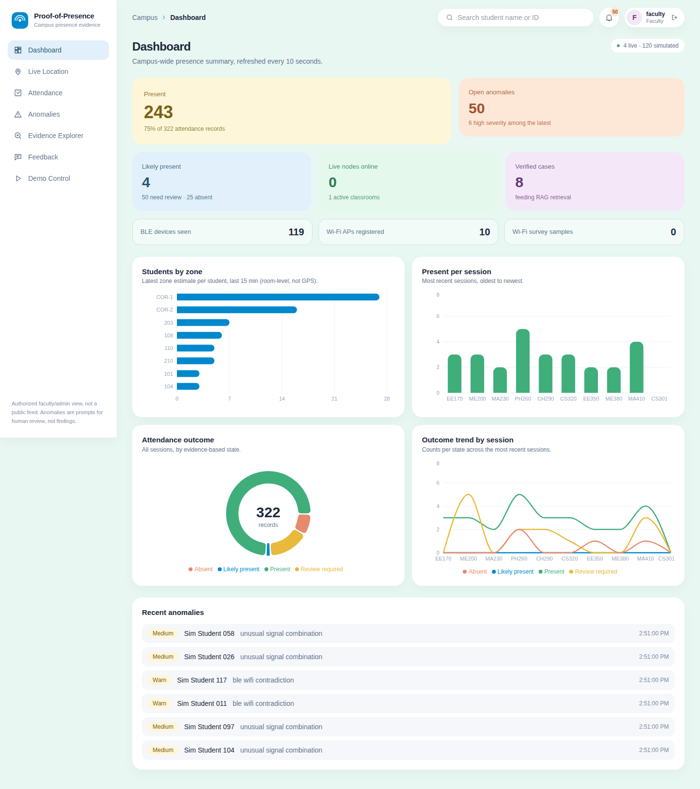
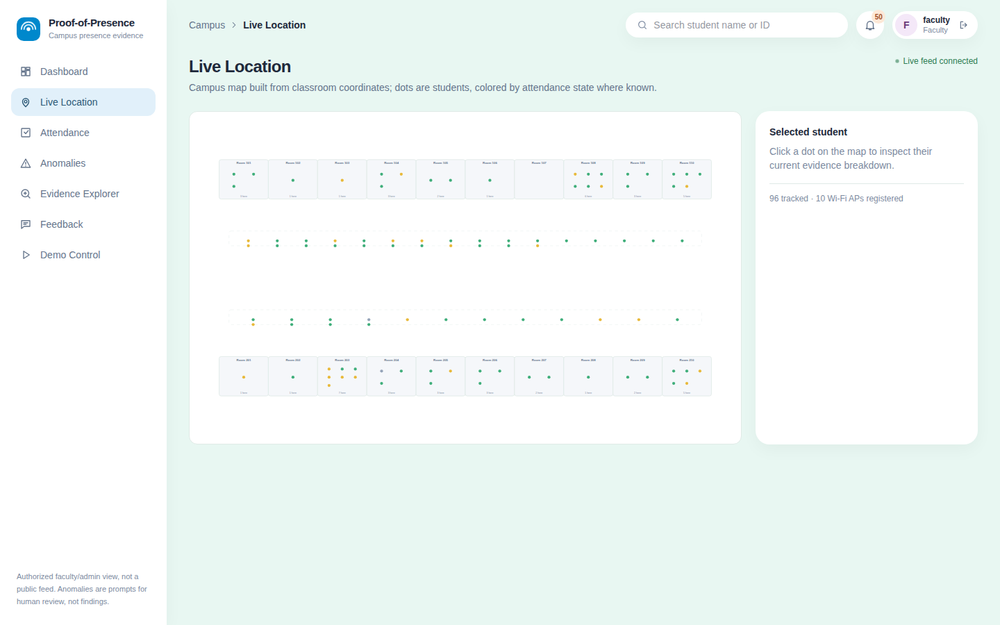

# Campus Proof-of-Presence

**Don't trust one check-in. Cross-validate multiple sources of evidence.**

IEEE BPDC CampusOPS hackathon project. Phones the students already carry produce Bluetooth LE and Wi-Fi evidence; a backend
fuses that evidence into an attendance state, flags unusual combinations for a human to review with rules and an
Isolation Forest, and explains each flag with score attribution, a small text knowledge base (RAG) and an optional Google
Gemini reasoning step. Faculty confirm or dismiss each case, and those decisions feed back into the retrieval index and into
a dataset for explicit model retraining.



*Dashboard with SIMULATED data (Demo Control, 120 students). Every number comes from the backend API.*

> **Prototype status.** This repository is a working prototype, not a deployed product. The attendance score is a transparent
> weighted checklist, not a validated probability, and the ML models ship trained on **synthetic** data. An anomaly is a prompt
> for a person to look, never proof of misconduct. See [Limitations](#limitations) and
> [`campus-presence/docs/LIMITATIONS.md`](campus-presence/docs/LIMITATIONS.md).

**Contents:** [Status](#current-status) · [Problem](#problem) · [Solution](#solution) · [Use cases](#use-cases) ·
[Architecture](#architecture) · [How it works](#how-it-works) · [Tech stack](#tech-stack) · [ML pipeline](#ml-pipeline) ·
[RAG + Gemini](#rag--gemini) · [Privacy](#privacy-and-security) · [Anti-spoofing](#anti-spoofing-and-cross-validation) ·
[Setup](#setup) · [Running](#running) · [API](#api-endpoints) · [Structure](#project-structure) · [Demo](#demo) ·
[Limitations](#limitations) · [Future work](#future-work)

---

## Current status

What exists in the code today, what is partial, and what is only an idea. Nothing in the "Implemented" column is claimed
without a test or a runnable path in this repository.

| Area | Implemented | In progress / partial | Planned (not in the code) |
|---|---|---|---|
| **BLE evidence** | Rotating HMAC tokens (30 s window), classroom marker + student token payloads, replay/stale/forged-token rejection, peer observations | Real-phone behaviour varies by model and OS; RSSI is noisy | Per-device RSSI calibration |
| **Wi-Fi evidence** | RSSI fingerprint to room/zone classifier (KNN / Random Forest), synthetic model + live model trained from staff surveys, on-phone nearest-centroid hint | Accuracy on real rooms is unmeasured (see audit in limitations) | Continuous re-survey, per-building models |
| **Evidence fusion** | Weighted score, `PRESENT` needs 2 independent signal families, four states, per-component provenance | Weights are hand-picked | Weights learned from labelled real data |
| **Anomaly detection** | 4 deterministic rules, Isolation Forest over 12 features, 0-100 display rescale | Proxy-phone detection is weak (forest only, no rule) | A rule on `rssi_twin_distance` once real classroom data sets a threshold |
| **Explainability** | Exact Shapley attribution of the forest score, counterfactual ("passes if these were typical"), rule evidence | | |
| **RAG** | TF-IDF retrieval over verified cases (8 seed + faculty feedback) and a 16-passage text knowledge base, with citations | KB covers system behaviour and policy, not your campus's rules | Embedding retrieval, per-campus KB tooling |
| **LLM** | Deterministic offline provider (default); Google Gemini provider with structured output, grounding and citation validation, automatic fallback | Gemini path is tested with a fake client; **it has not been run against a live API key in this repo** | Streaming answers, multi-turn case chat |
| **Feedback loop** | Confirm / false-positive / comment: stored, verified cases become RAG cases immediately, `ml/data/feedback_dataset.csv` regenerated | Retraining is a manual script (`ml/retrain_anomaly_model.py`) | Scheduled retraining, drift monitoring |
| **Faculty dashboard** | React dashboard: summary + charts, live map, attendance, anomalies with explanations, evidence explorer, feedback, demo control, WebSocket updates | | Role-specific views, exports |
| **Android app** | Student, classroom-node and Wi-Fi-surveyor roles; protocol + HTTP client unit-tested on the JVM; APK built by GitHub Actions | Needs physical phones; battery-optimisation behaviour differs by vendor | iOS, background-scan hardening |
| **Existing-system integration** | `POST /presence` accepts face-system and RFID evidence from staff accounts and fuses it as extra signal families | This is an ingest hook only | Connectors for a real LMS/ERP/attendance database, CSV import/export |
| **Simulation** | Synthetic campus (20 rooms, 10 APs, 22 zones, up to 300 students) with 6 injectable scenarios, everything tagged `SIMULATED` | | |
| **Auth / privacy** | JWT logins, role checks, pseudonymous rotating tokens, replay nonces, rate limiting, retention purge | Demo accounts and keys exist while `DEMO_MODE=1` | SSO, per-department access scopes, HTTPS termination guide |
| **Use cases** | Classroom attendance; daytime room-level campus presence (live map) | Event attendance works only as a session in a seeded classroom; last-known location is the latest estimate in a 15-minute window | Nighttime hostel presence, event-specific flows, emergency / last-known-presence workflow |

---

## Problem

A single check-in, whether a signature, a QR scan or one Bluetooth ping, is easy to share, forward or replay. Proxy
attendance, copied QR codes and "my friend has my phone" all defeat a single signal, while a tamper-proof
solution (cameras, biometric turnstiles in every room) is expensive and invasive. Faculty also have no cheap way to know
*why* an attendance record looks odd, so suspicious cases are either ignored or handled by guesswork.

## Solution

Collect several cheap, independent signals from the phone and the room, fuse them, and spend human attention only where the
signals disagree.

- **BLE** says a phone and a classroom marker were close, using tokens that change every 30 seconds.
- **Wi-Fi** says which room or zone the phone's access-point signal pattern resembles (a fingerprint, not GPS).
- **Peers** corroborate, but only when the student has an independent signal of their own.
- **Existing systems** (a face reader, RFID) can add evidence through the same fusion.
- **Rules + Isolation Forest** flag combinations that look unusual.
- **Explainability, RAG and Gemini** turn a flag into evidence-backed possible causes and checks a person can make.
- **Faculty feedback** closes the loop.

Multiple signals make simple spoofing harder; they do not make it impossible, and the system does not claim to.

## Use cases

| Use case | Status | How the system supports it |
|---|---|---|
| **Classroom attendance** | Implemented | A session in a classroom; each enrolled student gets an evidence-backed state (`PRESENT` / `LIKELY_PRESENT` / `REVIEW_REQUIRED` / `ABSENT`) and a per-signal breakdown. |
| **Daytime campus presence** | Implemented (room level) | Wi-Fi fingerprints and BLE place phones in rooms and corridors; the Live Location map shows each student's latest estimate. Room-level, not GPS. |
| **Nighttime hostel presence** | Planned | Not built. There are no hostel zones, no night-time rules and no warden role. The same BLE/Wi-Fi evidence model could be extended, with a separate privacy review. |
| **Event attendance** | Partial | Any session can be created in a seeded classroom (`POST /sessions`); there are no event-specific features (capacity, walk-in registration, QR). |
| **Emergency / last-known presence** | Partial | `GET /locations` returns each student's latest zone within a time window, which is the data an emergency view would use. There is no emergency workflow, alerting or roll-call screen. |

## Architecture

```
 BLE evidence ──┐
 Wi-Fi evidence ┼──> Evidence Fusion ──> Rules / Isolation Forest ──> Explainability ──> RAG ──> Google Gemini
 Existing       │                                                                                    │
 systems (face, ┘                                                                                    v
 RFID via /presence)                                                                         Faculty Dashboard
                                                                                                     │
                                                                                                     v
                                                                                                  Feedback
                                                                                            ┌────────┴────────┐
                                                                                            v                 v
                                                                                   RAG (verified cases)   ML dataset
                                                                                   used immediately       used only when
                                                                                                          you retrain
```

Components:

- **Phones** (`campus-presence/android`) advertise a rotating student token, scan for the room marker, and upload Wi-Fi scans.
- **Classroom nodes** (a second phone in the demo) advertise the room marker and report the student tokens they hear.
- **Backend** (`campus-presence/backend`) validates tokens, stores observations, scores, flags, explains and serves the dashboard.
- **Dashboard** (`campus-presence/frontend`) is built once and served by the backend at `/ui/`.

## How it works

1. **BLE.** A student phone advertises `0x01 | token[8]`; a classroom node advertises `0x02 | marker_idx[2] | token[8]`
   (company id `0xFFFF`). A token is an HMAC-SHA256 truncated to 8 bytes over a 30-second time window; the server accepts the
   current and adjacent windows, rejects readings more than 120 s from its own clock, and rejects a replayed nonce. The
   advertisement carries no real identity.
2. **Wi-Fi.** The phone uploads RSSI for the campus access points it can hear. A classifier trained on RSSI fingerprints
   (KNN or Random Forest) estimates the room or zone and a confidence. The shipped model is trained on a synthetic radio
   model; faculty can survey real rooms with the app (`/wifi/survey`) and retrain a live model (`/wifi/retrain`).
3. **Fusion.** Weighted points: classroom BLE 35, Wi-Fi 30, peers 20, sustained presence 10, face 5, RFID 5. `PRESENT` needs
   a score of at least 70 **and** at least two independent signal families; 50+ is `LIKELY_PRESENT`, 30+ `REVIEW_REQUIRED`.
   Bluetooth earns full points at -80 dBm or stronger (partial down to -85); Wi-Fi earns full points when 75% of scans agree
   on the session room. Evidence for a state below `PRESENT` includes plain-language `limiting_factors`, shown in Evidence
   Explorer ("Why this is not Present"). Every component records its provenance. Weights and thresholds are in `campus-presence/backend/app/config.py` and can be
   overridden (`FUSION_CONFIG`, `W_<NAME>`).
4. **Detection.** Four deterministic rules (`token_reuse`, `impossible_movement` above 4 m/s, `ble_wifi_contradiction`,
   `rapid_session_switching`) plus an Isolation Forest over 12 behaviour features. The forest runs only when at least 3
   nearby devices were seen, because it was trained at classroom density.
5. **Explanation.** Shapley attribution says which features drove the forest's score; the knowledge base and similar verified
   cases give context; the reasoning step proposes ranked causes with citations. See [RAG + Gemini](#rag--gemini).
6. **Review.** Faculty open the anomaly, read the explanation, and confirm or dismiss it. Confirming moves the student to
   `REVIEW_REQUIRED` for follow-up; dismissing restores the fused state. Nothing is ever marked `ABSENT` because of an anomaly.

## Tech stack

Only technology that is in the repository.

| Layer | Technology | Purpose | Status |
|---|---|---|---|
| Phone app | Kotlin, Android platform APIs (BLE advertiser/scanner, WifiManager, foreground services), Gradle 8.7 / AGP 8.5.2, minSdk 26 | Student, classroom-node and Wi-Fi-surveyor roles | Implemented |
| Phone app tests | JUnit on the JVM (39 tests) | Token vectors, aggregation, request bodies, HTTP client | Implemented |
| Backend API | Python, FastAPI, Uvicorn | REST + WebSocket | Implemented |
| Storage | SQLAlchemy 2, SQLite | Observations, sessions, anomalies, feedback | Implemented |
| Auth | PyJWT, PBKDF2 password hashing | Faculty / admin / student logins | Implemented |
| Tokens | HMAC-SHA256 (Python stdlib; Kotlin twin) | Rotating BLE tokens | Implemented |
| Wi-Fi localisation | scikit-learn KNN / Random Forest, joblib | RSSI fingerprint to room | Implemented (synthetic + survey-trained) |
| Anomaly detection | scikit-learn Isolation Forest + rule engine | Review queue | Implemented |
| Explainability | NumPy, exact Shapley over the 12 features | Why the forest flagged a case | Implemented |
| RAG | TF-IDF over verified cases + Markdown knowledge base | Grounding for explanations | Implemented |
| LLM | Offline deterministic provider; Google Gemini via `google-genai` | Cited reasoning over retrieved evidence | Mock implemented; Gemini implemented, not run with a live key here |
| Dashboard | React 19, TypeScript 6, Vite 8, Tailwind CSS 4, React Router 7, Recharts | Faculty UI | Implemented |
| Simulation | NumPy-based generator in `campus-presence/simulation` | Synthetic campus and attack scenarios | Implemented |
| Tests / CI | pytest (campus backend and legacy backend), oxlint + `tsc`, GitHub Actions (APK build + Kotlin tests) | Regression | Implemented |

## ML pipeline

- **Features (12):** BLE duration (normalised to a 50-minute session), mean BLE RSSI, Wi-Fi confidence, nearby device count,
  token reuse count, time between locations, estimated speed, number of classrooms, session switch count, BLE/Wi-Fi signal
  consistency, strongest peer RSSI, `rssi_twin_distance` (how closely another phone's signal tracks this one).
- **Training data:** `ml/generate_dataset.py` writes synthetic normal behaviour plus injected scenarios (proxy attendance,
  impossible movement, Wi-Fi/BLE mismatch, token replay, short presence, false-positive look-alikes). The model is trained
  on this synthetic data. It shows the pipeline works; it says nothing about real accuracy.
- **Model:** scikit-learn `IsolationForest` (200 trees). Raw score is `score_samples`; `risk_demo` (0-100) is a display rescale,
  **not a probability**.
- **Audit:** `python ml/audit_models.py` reports stability across splits and where each model fails. On synthetic data it
  found the forest strong on short presence and impossible movement, weak on proxy phones (10% to 96% by split), and nearly
  blind to features that rarely vary, which is why the deterministic rules exist. Details in
  [`campus-presence/docs/LIMITATIONS.md`](campus-presence/docs/LIMITATIONS.md).
- **Retraining:** explicit only. `python ml/retrain_anomaly_model.py` reads `ml/data/feedback_dataset.csv`; faculty-confirmed
  false positives become normal rows. The server never retrains by itself.

## RAG + Gemini

**RAG is retrieval, not ML training.** Retrieval changes what the explainer is shown; it does not change any model.

1. **Attribution (XAI).** Exact Shapley values over the 12 features, against a baseline of the training median, give "flagged
   mostly because of X and Y" and whether the record would have passed with typical values. It explains the model's score,
   not anyone's intent.
2. **Retrieval.** Tags derived from the case (rule hits, bucketed signal values) retrieve the most similar **verified cases**
   (8 seed cases plus every case faculty resolved) and the most relevant **knowledge passages** from
   `campus-presence/backend/app/knowledge/system_kb.md` (16 passages: what each rule and feature means, common innocent
   causes, policy). Scoring is deterministic: tag overlap plus TF-IDF.
3. **Reasoning.** The provider receives only the evidence, the attribution and the retrieved passages, and returns ranked
   possible causes, each with a likelihood, the evidence fields and sources it cites, and checks faculty can make.
   - Default provider is offline and deterministic (no network, no key).
   - **Gemini** is optional (`LLM_PROVIDER=gemini`). It runs at temperature 0 with a response schema. **Gemini does not decide
     attendance and may not invent evidence.** Its answer is rejected, and the offline explanation used instead (with the
     reason shown in the UI), if it mentions a number that is not in the evidence, cites a field, passage or case that was not
     provided, offers an uncited cause, or uses accusatory wording. This catches invented facts and unsupported causes; it
     cannot prove a sentence is true, which is why the cited sources are displayed next to it.
4. **Feedback.** Confirm or false-positive on an anomaly stores the decision. The case joins the RAG index at once, and `ml/data/feedback_dataset.csv`
   is regenerated from all labelled decisions; it is used only if someone runs the retraining script.

## Privacy and security

- BLE advertisements carry rotating pseudonymous tokens, never a name or student ID. Tokens change every 30 s.
- A student's token secret is returned only to that student after login (`GET /auth/provision`). Use HTTPS outside a lab
  network; the demo runs over plain HTTP on a LAN.
- Role checks: students can upload their own evidence and see themselves; faculty/admin see the dashboard, anomalies and
  explanations; only staff can submit face/RFID evidence, run surveys or simulations.
- Replay protection (nonce), timestamp window, per-endpoint rate limits, and a retention purge (`RETENTION_DAYS`, default 30).
- With Gemini on, what leaves the machine is: a pseudonymous student label (a hash, unless `GEMINI_SEND_REAL_IDS=1`), rooms,
  signal values, scores, retrieved passages, and the **text of similar past cases including faculty comments**. Do not type
  anything into a feedback comment that should not reach Google.
- Demo accounts (`faculty`, `admin`, `HIMESH`, `STU101`-`STU103`, password `demo1234`) and demo node keys
  (`node-<room>-demo`) exist only while `DEMO_MODE=1`, the default. Set `DEMO_MODE=0` and a real `JWT_SECRET` for anything
  that is not a demo.
- A real deployment needs university approval for location data, a retention policy, and access control reviewed by whoever
  owns student data. This repository does not provide those.

## Anti-spoofing and cross-validation

Multiple signals make simple spoofing harder. None of this makes spoofing impossible: a determined attacker with enough
phones and time can still fool a prototype like this.

| Attack | What the system does |
|---|---|
| Copy or relay a BLE token | Tokens expire in 30 s; the same token heard by two places raises `token_reuse`. |
| Replay an old upload | Nonce + timestamp window rejection. |
| Forge a token / impersonate another student | HMAC check against the student's own secret; the upload's account must match the token. |
| "Be seen" by BLE while somewhere else | BLE room vs. Wi-Fi room; a sustained mismatch raises `ble_wifi_contradiction`. |
| Teleporting between rooms | `impossible_movement` (implied speed above 4 m/s), `rapid_session_switching`. |
| Several phones carried together | Forest feature `rssi_twin_distance`. **Weak today**; no rule covers it. |
| BLE only, no second signal | Cannot reach `PRESENT` (needs two independent families). |
| Peers vouching for each other | Peers count only alongside the student's own independent signal. |

## Setup

### Prerequisites

- Python 3.10+ and `pip`
- Node.js 20.19+ (or 22.12+) and `npm` (to build the dashboard; Vite 8 requires it)
- For real phones: Android Studio with JDK 17 (or the prebuilt APK, below), two physical Android phones (emulators have no
  usable BLE), and the phones and PC on the same Wi-Fi. Android 12+ will ask for Nearby devices and Location permissions.
- Optional: a Google Gemini API key. **Without one, the system runs fully using the offline explainer.**

### Clone

```bash
git clone https://github.com/himeshsoni704/BLE-WiFi.git
cd BLE-WiFi
```

### Backend

```bash
cd campus-presence/backend
python -m venv .venv
. .venv/bin/activate              # Windows: .venv\Scripts\activate
pip install -r requirements.txt
```

There is no database setup step: SQLite is created in `campus-presence/backend/data/` on first start, with the campus layout
and demo accounts. The first start also trains the synthetic Wi-Fi and Isolation Forest models (about a minute); later
starts take seconds.

### Frontend

```bash
cd campus-presence/frontend
npm install
npm run build                      # served by the backend at http://localhost:8000/ui/
# or for hot reload:  npm run dev  # http://localhost:5173 (proxies /api and /ws to :8000)
```

### Android

Option A, prebuilt: GitHub **Actions** tab, workflow **Android APK**, newest successful run, download the `app-debug` artifact
(or press *Run workflow* to build a fresh one), unzip, and install the APK on each phone.

Option B, from source: open `campus-presence/android` in Android Studio (JDK 17) and Run, or
`./gradlew assembleDebug` with the Android SDK installed. Full guide:
[`campus-presence/android/README.md`](campus-presence/android/README.md).

Permissions the app asks for: Bluetooth scan/advertise/connect and Nearby Wi-Fi devices (Android 12+/13+), Location (required
by Android for BLE and Wi-Fi scan results), notifications (foreground service). Location is used by Android to release scan
results; the app does not read GPS coordinates.

### Point the app at the backend

In the app, set **Server** to `http://<your-PC-LAN-IP>:8000` (not `localhost`, which on a phone means the phone) and press
**Check server**. Allow port 8000 through the PC firewall. The check reports the phone's clock offset: readings more than 120 s
from the server clock are rejected.

### Gemini key (optional)

Never commit keys. Set them in the shell you start the backend from:

```bash
export LLM_PROVIDER=gemini
export GEMINI_API_KEY=your_key_here
export GEMINI_MODEL=<a model id your key can use>
```

```powershell
$env:LLM_PROVIDER = "gemini"; $env:GEMINI_API_KEY = "your_key_here"; $env:GEMINI_MODEL = "<a model id your key can use>"
```

`GET /config` and the Explain card show which provider answered. The Gemini path has been tested here only with a fake
client; if a live call fails, the system falls back to the offline explainer and says so.

### RAG

No setup. The knowledge base is the Markdown file `campus-presence/backend/app/knowledge/system_kb.md` (add campus policy as
new `## KB-<ID> | Title` passages with `tags:` and a short paragraph); verified cases accumulate through the Feedback buttons.

## Running

**Backend** (serves the API, WebSocket and the built dashboard):

```bash
cd campus-presence/backend
uvicorn app.main:create_app --factory --host 0.0.0.0 --port 8000
```

API docs at `http://localhost:8000/docs`; dashboard at `http://localhost:8000/ui/`. Sign in as `faculty` / `demo1234`.

**Frontend (development only):** `cd campus-presence/frontend && npm run dev`.

**Android:** install the APK, choose a role, enter the server URL, press Start.

**Complete demo, no phones (SIMULATED):** start the backend, build the frontend, sign in, open **Demo Control**, press
*Start Simulation* (about 16 s for 300 students; a smaller number is faster).

**Complete demo with real phones (LIVE):** see the steps below and
[`campus-presence/android/README.md`](campus-presence/android/README.md).

Other commands:

```bash
cd campus-presence/backend && pytest                       # campus backend tests (about 2 minutes)
cd campus-presence/android && ./gradlew test               # JVM unit tests for the phone protocol code
cd campus-presence/frontend && npm run build && npm run lint
cd backend && pytest                                       # the separate legacy project (see below)
```

Configuration variables (all optional) are tabulated in [`campus-presence/README.md`](campus-presence/README.md#configuration).

## API endpoints

Generated from the FastAPI routes (`campus-presence/backend/app/routers/*.py`, `main.py`). "Staff" = `faculty` or `admin`.
Interactive docs: `/docs`.

| Method | Path | Who | Purpose |
|---|---|---|---|
| POST | `/auth/login` | anyone (10/min) | Username + password to JWT |
| GET | `/auth/me` | signed in | Current user |
| GET | `/auth/provision` | student | The student's own token secret and campus catalogue |
| POST | `/ble-observation` | student | Upload BLE tokens seen (RSSI, timestamps) |
| POST | `/wifi-observation` | student | Upload Wi-Fi scan; returns room estimate |
| POST | `/presence` | signed in | Combined upload; staff may include `face` / `rfid` blocks from existing systems |
| GET | `/nodes/provision` | node key (`X-Node-Key`) | Classroom node's room and marker secret |
| POST | `/nodes/heartbeat` | node key | Node reports student tokens it heard |
| GET | `/wifi/reference` | signed in | Room centroids for the on-phone hint |
| POST | `/wifi/survey` | staff | Upload labelled scans for a room |
| POST | `/wifi/retrain` | staff | Retrain the live Wi-Fi model from surveys |
| GET | `/students`, `/classrooms` | signed in | Rosters and rooms (students see only themselves) |
| GET / POST | `/sessions` | signed in / staff | List sessions; create a live session |
| GET | `/attendance` | signed in | Attendance per session |
| GET | `/evidence/{student_id}` | signed in | Per-session score breakdown and observation timeline |
| GET | `/locations` | staff | Latest zone estimate per student in a time window |
| GET | `/summary` | staff | Dashboard counters |
| GET | `/anomalies`, `/anomalies/{id}` | staff | Review queue and detail |
| POST | `/explain-anomaly` | staff | Attribution + knowledge + cited reasoning (30/min) |
| POST | `/rag/retrieve` | staff | Retrieved verified cases and knowledge passages |
| POST | `/feedback` | staff | Confirm / false positive / comment |
| GET | `/feedback/summary` | staff | Decisions, verified cases, dataset size, retrain command |
| POST | `/simulation/start`, `/simulation/reset` | staff | Generate or remove SIMULATED data |
| GET | `/simulation/status` | staff | Simulation progress |
| POST | `/models/reload` | staff | Reload model files |
| GET | `/health`, `/config` | public | Liveness; active provider, weights, thresholds |
| WS | `/ws` | token in query | Live events: new anomalies, node heartbeats, feedback, simulation progress |

## Project structure

```
.
├── campus-presence/              # the hackathon project
│   ├── backend/
│   │   ├── app/
│   │   │   ├── main.py, core.py, bootstrap.py, config.py, db.py, models.py, schemas.py, security.py, seed.py
│   │   │   ├── tokens.py, ble.py        # rotating HMAC tokens, BLE payloads
│   │   │   ├── wifi.py, wifi_live.py    # fingerprint classifier, survey-trained live model
│   │   │   ├── ingest.py, pipeline.py   # validation and per-session scoring
│   │   │   ├── fusion.py, rules.py      # evidence fusion, deterministic rules
│   │   │   ├── anomaly.py, mltrain.py   # Isolation Forest, training helpers
│   │   │   ├── xai.py                   # exact Shapley attribution
│   │   │   ├── rag.py, knowledge.py, knowledge/system_kb.md   # case + text retrieval
│   │   │   ├── llm/                     # base (validation, grounding), mock, gemini
│   │   │   └── routers/                 # auth, data, ingest_routes, ai, sim, ws
│   │   └── tests/                       # 13 test modules
│   ├── frontend/src/                    # React app: pages/, components/, hooks/, services/, types/
│   ├── android/                         # Kotlin app, Gradle wrapper, JVM tests
│   ├── simulation/                      # synthetic campus + scenario generator
│   ├── ml/                              # dataset generation, training, retraining, audit; models/ reports
│   └── docs/                            # LIMITATIONS.md, THIRD_PARTY.md
├── backend/ and android/         # separate gait / handed-phone project (see below)
├── docs/screenshots/             # README images
└── .github/workflows/android-apk.yml   # APK build + Kotlin tests
```

## Demo

Eleven steps, about ten minutes. Steps 1-8 use only **SIMULATED** data. Steps 9-10 add **LIVE** phones and are optional.

1. **Start the backend** (`uvicorn app.main:create_app --factory --host 0.0.0.0`) and open `/ui/`; sign in as `faculty`.
2. **Demo Control → Start Simulation.** Creates a SIMULATED campus (students, sessions, injected anomalies). Everything it creates is tagged SIMULATED.
3. **Dashboard.** SIMULATED attendance counts, charts and open anomalies.
4. **Live Location.** The campus map with SIMULATED students per room and corridor. Room-level estimates, not GPS.
5. **Evidence Explorer** (or the header search). Pick a student: the weighted evidence breakdown (BLE, Wi-Fi, peers, sustained presence) and the observation timeline. This is the "cross-validate" moment.
6. **Anomalies → Explain** on a case. Shows rule hits, Isolation Forest attribution ("flagged mostly because of…"), retrieved knowledge and similar verified cases, and cited possible causes. Provider shown on the card: *mock* by default, *gemini* only if configured and its answer passed validation.
7. **Inject a scenario** (Demo Control → e.g. Proxy Attendance or Token Replay). A new SIMULATED anomaly arrives over the WebSocket.
8. **Feedback.** Press *Confirm* or *False Positive* on the case. The decision joins the RAG cases immediately and is written to the ML dataset (used only on explicit retrain). *Confirm* moves that student's final state to `REVIEW_REQUIRED` (never `ABSENT`); *False Positive* restores the fused state.
9. **LIVE (optional): survey and start a session.** Faculty phone: Wi-Fi surveyor, survey two rooms, retrain. Demo Control → *Start a fresh live session*.
10. **LIVE (optional): two phones.** One phone as classroom node (`node-204-demo`), one as student (`HIMESH` / `demo1234`). The Room 204 marker flips from SIMULATED to LIVE, and the student becomes `PRESENT` after about two minutes of BLE plus a matching Wi-Fi room. SIMULATED and LIVE data coexist; each keeps its label.
11. **Close the loop.** Repeat step 6 on a case after step 8 and see the verified case appear among the similar cases. Optionally `python ml/retrain_anomaly_model.py` (from `campus-presence`) to use the feedback dataset, then `POST /models/reload`.



## Limitations

- **BLE RSSI is noisy.** Body, bag, phone model and orientation move it by many dB; it indicates proximity, not distance.
- **Wi-Fi scan restrictions.** Android throttles Wi-Fi scans (a few per minute) and only releases results with Location
  permission and services on; iOS is not supported. Wi-Fi quality depends on how well the rooms were surveyed.
- **Room-level, not GPS-level.** Wi-Fi gives a room or zone estimate from fingerprints; it is not coordinates.
- **Synthetic simulation.** The shipped models and every SIMULATED number come from synthetic data. They show the pipeline
  works, not how accurate it is on a real campus. The live Wi-Fi model's cross-validated accuracy is optimistic.
- **An anomaly is not proof of misconduct.** It is an unusual signal combination; innocent causes (late arrival, a dead
  battery, a phone left in a bag) are common. Humans decide.
- **Proxy-phone detection is weak.** Only the forest sees it, 10% to 96% by data split on synthetic data, and no rule covers it.
- **Gemini must be grounded in evidence.** Its output is validated against the supplied evidence and sources, which catches
  invented numbers and uncited claims but cannot prove a sentence true. The Gemini path has not been run against a live key
  in this repository.
- **Privacy and access control.** Location and attendance data is sensitive. A real rollout needs university approval,
  consent and retention policy, HTTPS, and access control that is not the demo accounts.
- The attendance score is a hand-weighted checklist, not a calibrated probability.

## Future work

- Real-campus data collection, then recalibrated Wi-Fi and anomaly models and learned fusion weights.
- A rule on `rssi_twin_distance` for proxy phones, with a threshold set from real classroom data.
- Connectors to existing attendance, LMS or RFID systems; CSV import/export.
- Hostel / night-time presence and an emergency last-known-presence view, each with its own privacy review.
- Event attendance features (walk-in registration, capacity).
- SSO and department-scoped access, HTTPS deployment guide.
- Scheduled retraining and drift monitoring from the feedback dataset; embedding-based retrieval.
- iOS client.

## The other project in this repository

`backend/` and `android/` at the top level are an earlier, separate experiment (a handed-phone / gait risk score) with its own
server, protocol (`X-API-Key`, tokens `ble-wifi/v1`) and app. They do not talk to `campus-presence/`. Use `campus-presence/` for
the hackathon demo; see [`backend/README.md`](backend/README.md) and [`android/README.md`](android/README.md) for the legacy
project. More detail on the main project: [`campus-presence/README.md`](campus-presence/README.md),
[`campus-presence/android/README.md`](campus-presence/android/README.md),
[`campus-presence/docs/LIMITATIONS.md`](campus-presence/docs/LIMITATIONS.md),
[`campus-presence/docs/THIRD_PARTY.md`](campus-presence/docs/THIRD_PARTY.md).
